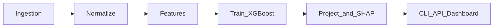

# ScoutSync ML System Design

**Status:** Built (demo / portfolio)  
**Live demo:** [Streamlit Cloud](https://scoutsync-ml-sumemxdakhf3zpuagqcyae.streamlit.app/)  
**Related docs:** [README.md](../README.md)

---

## Purpose and Scope

Scouts and analysts often need to compare players across leagues where the raw numbers are not directly comparable. A 98 mph fastball in college faces weaker hitters than in MLB. A 420-foot fly ball at altitude travels farther than the same contact at sea level. Competition tier and stadium environment both distort what the tracking data appears to say.

ScoutSync ML addresses one question:

> After adjusting for stadium environment and league competition level, what MLB-equivalent wOBA (batters) or ERA (pitchers) should we expect from this player?

The system ingests pitch-level tracking data, normalizes it, trains separate batter and pitcher translation models, and outputs point projections with 90% confidence intervals and per-player SHAP attributions. Results are exposed through a CLI, a FastAPI server, and a Streamlit dashboard.

**In scope (built today):**

- Pitch-level tracking ingestion (MLB Statcast via pybaseball, synthetic NCAA/Cape Cod data, Trackman CSV/JSON upload)
- Environmental and league-tier normalization
- XGBoost translation models for batters (wOBA) and pitchers (ERA)
- Projections with confidence intervals and SHAP explainability
- CLI, FastAPI, and Streamlit interfaces

**Out of scope:**

- Production data contracts with Trackman or Hawkeye vendors
- Real amateur roster feeds or live game pipelines
- Model registry, authenticated serving, multi-tenant operations
- CI/CD workflows (README references GitHub Actions; no workflows exist in the repo)
- Human scout validation studies

This is a research and demo harness, not a production scouting product.

The pipeline has five phases:



---

## Baseline Evidence and Risk

The architecture is complete, but several limitations affect how results should be interpreted.

| Risk | What it means |
|---|---|
| Synthetic amateur data | The amateur cohort (120 players by default) is generated, not real Trackman exports |
| Simulation-only validation | Labels are the generator's own ground truth, so the backtest measures signal recovery, not real predictive accuracy |
| No model artifacts in repo | `.joblib` files and `residual_std.json` are gitignored; produce them with `python main.py train` |
| Small cohort | ~12 held-out players per role means backtest metrics carry wide uncertainty |
| Assumed constants | The carry sensitivity (0.28) is derived from published Coors figures; the tier map (`gamma_tier_map`) is chosen, not fitted |
| Unused park factors | `park_factor_hr` / `park_factor_obp` are stored but do not feed the adjustment |

These are stated limitations, not hidden defects. The central one is the second row: no
public dataset links amateur tracking data to major-league outcomes at the player level,
so a genuinely validated translation model cannot be built from open data alone.

### Previously shipped defects, now fixed

An earlier revision had four problems severe enough to record here:

1. **The hosted demo displayed hard-coded numbers.** `dashboard.py` inserted fixed
   projections and SHAP payloads for three real major-league players and rendered them as
   model output. No model ran on the cloud path. The demo now seeds and trains on cold
   start, and `tests/test_no_fabricated_output.py` statically blocks a regression.
2. **Training labels were fabricated by round-robin.** Amateur player *i* was paired with
   MLB rookie *i mod N* — no relationship between the two. Replaced by per-player ground
   truth from the generator.
3. **The pitcher model was degenerate.** Its target was a constant, so every player got
   ERA 4.50 with a `[4.50, 4.50]` interval and all-zero SHAP values. Fixed by training one
   single-output regressor per role.
4. **SHAP discarded direction.** Payloads used `mean(|SHAP|)` plus a hard-coded sign flip
   for one feature. Per-player contributions are now signed.
5. **The environmental model contradicted the physics.** `air_density_kg_m3` computed
   density at a fixed sea-level pressure, so density never varied with altitude at all —
   the only thing moving it was a humidity term roughly 38x too strong. Meanwhile release
   speed was scaled *up* at altitude (compounding bias rather than removing it) while
   carry, the effect that actually exists, was not corrected at all. Rewritten against
   the barometric formula and published Coors figures; see below.

---

## Core Questions the System Answers

1. **After environment adjustment**, what do this player's velocity, power, or command metrics look like on an MLB-equivalent scale?
2. **Given league tier and age**, what wOBA or ERA should we expect if the player reached MLB?
3. **Which inputs drove the projection?** SHAP attributions rank the feature contributions for each player.

---

## System Design

### 1. Database bootstrap

[`db/schema.sql`](../db/schema.sql) defines leagues (MLB through Cape Cod, tiers 1–5), stadium environments, players, raw tracking rows, MLB projections, and backtest run records. PostgreSQL runs via [`docker-compose.yml`](../docker-compose.yml). Set `USE_SQLITE=true` for a local or cloud SQLite database.

### 2. Ingestion

- [`src/ingestion/pybaseball_loader.py`](../src/ingestion/pybaseball_loader.py) — MLB Statcast via pybaseball with CSV cache; falls back to offline sample CSV on Streamlit Cloud
- [`src/ingestion/synthetic_seed.py`](../src/ingestion/synthetic_seed.py) — synthetic NCAA and Cape Cod players, stadiums, and tracking rows
- [`src/ingestion/parsers.py`](../src/ingestion/parsers.py) — Trackman CSV and JSON parsing, exposed through FastAPI upload routes

### 3. Normalization

- [`src/normalization/environment.py`](../src/normalization/environment.py) — altitude, air density, velocity and break adjustments
- [`src/normalization/league_context.py`](../src/normalization/league_context.py) — tier-based scaling against league baselines

Raw tracking passes through environmental adjustment first, then league-context normalization, before feature aggregation.

### 4. Feature build and train

[`src/features/builder.py`](../src/features/builder.py) aggregates pitch-level rows into player-season features. [`src/ml/model.py`](../src/ml/model.py) fits XGBoost regressors (sklearn GradientBoosting fallback) with a player-level 80/20 train/validation split and saves artifacts to `data/models/`.

### 5. Project and explain

[`src/pipeline.py`](../src/pipeline.py) runs the full train path and persists projections to the database. [`src/ml/shap_engine.py`](../src/ml/shap_engine.py) computes per-player SHAP values stored as JSON on each projection row.

Orchestration entry point: [`main.py`](../main.py) with commands `init-db`, `seed`, `train`, `backtest`, `project`, and `serve`.

---

## Data Model and Splits

**Reference leagues** are seeded at init: MLB (tier 1), NPB (2), KBO (3), NCAA (4), CCL (5).

**Training population:** amateur tiers ≥ 4 with tracking rows. Labels come from
`player_ground_truth`, written by [`src/ingestion/synthetic_seed.py`](../src/ingestion/synthetic_seed.py)
at seed time. Each synthetic player is drawn from a latent `talent` parameter that drives
both their tracking rows and their stored outcome, so a label always belongs to the player
it is attached to. MLB reference players are deliberately unlabeled — they exist to set
tier-1 baselines and are excluded from both training and projection output.

**Validation split:** player-level 80/20 holdout inside `train_models_from_frames` in
[`src/ml/model.py`](../src/ml/model.py). The held-out player ids are persisted into
`residual_std.json` alongside the model so the backtest can score exactly those players.
This is an internal split, not a frozen external test set.

**Backtest partition:** [`src/validation/backtest.py`](../src/validation/backtest.py)
scores only the persisted held-out players and reports RMSE, MAE, and skill against a
predict-the-cohort-mean baseline. When no held-out list is present it says so explicitly
rather than quietly reporting in-sample fit. Results are stored in `backtest_runs`.

---

## Environmental Normalization

Air density is computed from the ISA barometric formula plus a vapour-pressure humidity
term, and reproduces the published Coors ratio (0.83 computed against 0.82 reported).

Corrections are applied only where air density is the causal mechanism:

| Metric | Mechanism | Correction |
|---|---|---|
| Break / movement | Magnus force ∝ air density; Coors ≈ 82% of sea level | Scale up by `ρ_ref / ρ_park` |
| Batted-ball distance | Reduced drag; ~5% more carry at Coors | Divide by the carry factor |
| Release speed | Measured out of the hand; drag acts afterwards | None (documented identity) |
| Exit velocity | Measured off the bat | None |
| Spin rate | Imparted by the hand | None |

The plate-speed effect is real but small — a ball loses about 8% of its speed at Coors
versus 10% at Fenway, roughly 1 mph — and applies to plate velocity, not to the release
velocity Statcast reports. It is deliberately not modeled.

Reference: Alan Nathan, [Baseball At High Altitude](https://baseball.physics.illinois.edu/Denver.html).

---

## Model and Projection Logic

**Targets:** one single-output regressor per role — batters predict wOBA, pitchers predict
ERA. There is no multi-output wrapper and no placeholder target column;
`prepare_targets` raises on a missing or partially-missing label rather than defaulting to
a constant.

**Confidence intervals:** held-out residual standard deviation × 1.645 (90%), stored per
role in `residual_std.json`.

**Explainability:** signed per-player SHAP values are serialized to
`mlb_projections.shap_explainability_json` at train time and surfaced in the dashboard and
API. Positive means the factor pushed the projection up; for ERA that is worse, and the
dashboard colours accordingly. Aggregate `mean(|SHAP|)` is used only for training logs.

**Features:**

- Pitchers: adjusted velocity, spin rate, vertical and horizontal break, vertical approach angle, extension, strike-zone command rate, age relative to league, tier coefficient
- Batters: max exit velocity, 90th-percentile exit velocity rate, sweet-spot launch angle rate, zone contact rate, out-of-zone chase rate, age relative to league, conference strength factor

---

## Interfaces and Deployment Modes

| Surface | Role |
|---|---|
| CLI [`main.py`](../main.py) | Full local pipeline: init, seed, train, backtest, project, serve |
| FastAPI [`src/ingestion/fastapi_app.py`](../src/ingestion/fastapi_app.py) | Health check, Trackman/JSON upload, projection read API |
| Streamlit [`dashboard.py`](../dashboard.py) | Player search, projection summary, outcome distribution, SHAP chart, raw vs adjusted tracking histograms |

**Local full mode:** PostgreSQL or SQLite. Run `seed` then `train`. Dashboard reads real projections, SHAP, and pitch-level tracking charts from the database.

**Cloud lite mode:** On Streamlit Cloud, `bootstrap_sqlite_database()` in [`dashboard.py`](../dashboard.py) creates SQLite with three mock players and fixed projections. Tracking charts are skipped when the schema lacks `raw_tracking_data`.

Local setup:

```bash
docker compose up -d                    # optional Postgres
python main.py init-db
python main.py seed
python main.py train
USE_SQLITE=true streamlit run dashboard.py
```

---

## Evaluation

**What exists today:**

- Held-out backtest metrics (RMSE, MAE, and skill vs a mean baseline for both wOBA and ERA), stored in `backtest_runs`; currently +38.2% wOBA and +68.0% ERA skill
- 65 tests across normalization math, the model layer, SHAP payload semantics, and the full seed → train → project pipeline
- Regression tests pinning each previously shipped defect listed above
- GitHub Actions CI running lint plus tests on Python 3.11–3.13, and a network-free end-to-end CLI smoke test

**What is not evaluated:**

- Human scout agreement with projections
- Calibration against real signing outcomes
- Out-of-time generalization on held-out seasons

No go/no-go decision framework exists. Backtest output is informative, not decision-grade.

---

## Reproducibility and Artifacts

A full local run produces:

- Database state (Postgres volume or `scoutsync.db`)
- `data/pybaseball_cache/` (optional Statcast cache)
- `data/models/pitcher_model.joblib`, `batter_model.joblib`, `residual_std.json`
- Rows in `mlb_projections` with SHAP JSON

Configuration via [`.env.example`](../.env.example) and [`src/config.py`](../src/config.py): `DATABASE_URL`, `USE_SQLITE`, `VALIDATION_YEAR`, and normalization constants (`ALPHA`, `ALT_STD_FT`, `RHO_STD`, tier map in `gamma_tier_map`).

---

## Outcome Interpretation and Next Steps

### Demo-ready (current state)

The Streamlit Cloud deployment works with mock data. The portfolio narrative — cross-league normalization, ML translation, explainability — is coherent and demonstrable without local setup.

### Local research-ready

Running `seed` and `train` locally enables the full pipeline: trained models, backtest metrics, and dashboard charts for raw vs adjusted tracking distributions. Requires one-time environment setup and network access for pybaseball on first seed.

### Production path (not started)

A production scouting tool would need real amateur and international data feeds, validated translation baselines against known signings, a frozen evaluation protocol, CI, model versioning, and a scout UX study.

**Suggested next steps:**

1. Run the full local pipeline and either commit trained artifacts or document why they stay local
2. Add a README setup section linking to this design doc
3. Add GitHub Actions running the existing normalization tests
4. Decide whether to keep this as a portfolio demo or invest in real amateur data integration
